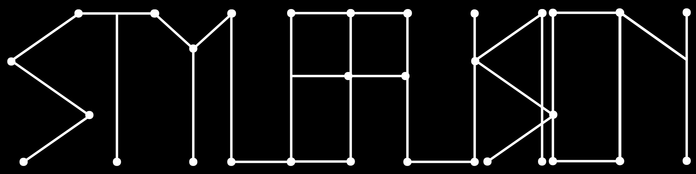

<p align="center">
  
</p>

<h1 align="center">StyleFusion</h1>

<p align="center">
  <strong>AI image generation through structured visual intelligence.</strong><br/>
  Extract. Compile. Generate. Compare.
</p>

<p align="center">
  <a href="https://sf.hob.farm">Launch App</a> ·
  <a href="https://hob.farm">HobFarm</a> ·
  <a href="docs/architecture.md">Architecture</a> ·
  <a href="docs/providers.md">Providers</a> ·
  <a href="docs/creative-slots.md">Creative Slots</a>
</p>

---

## What is StyleFusion?

StyleFusion is an AI image generation platform that treats prompt engineering as a compilation problem, not a writing exercise.

Instead of crafting prompts by hand, StyleFusion extracts structured metadata from reference images, compiles that metadata through a slot-based architecture, enriches it with a 157,000+ term visual vocabulary, and routes the result to multiple generation providers simultaneously.

The output: the same creative intent rendered across different AI models, side by side, so you can compare and choose.

## How It Works

**1. Reference Upload**
Drop in one or more reference images. These aren't used for img2img or style transfer. They're analyzed for visual structure: subject, scene, camera, lighting, color, composition, and rendering characteristics.

**2. Extraction**
Gemini models parse each reference into an Intermediate Representation (IR), a structured JSON object describing what's in the image across dozens of visual dimensions. The system detects whether the reference is photographic, CGI, illustration, or painterly, and adapts its extraction strategy accordingly.

**3. Creative Slots Compilation**
The IR feeds into the Creative Slots compiler, which organizes visual metadata into categorical slots (subject, environment, lighting, camera, style, rendering). Each slot has rules for how its contents combine, overlap, and resolve conflicts when multiple references contribute to the same dimension.

**4. Grimoire Enrichment**
The [Hob Grimoire](https://github.com/HobFarm/grimoire), a visual vocabulary database with 157,000+ classified atoms, enriches the compiled slots. Each atom carries harmonic scores across five dimensions (hardness, temperature, weight, formality, era affinity), and the Conductor selects atoms that resonate with the target arrangement profile. Atomic Noir, Cyberpunk, Film Noir, Art Deco, and 13+ other arrangement profiles each produce distinct tonal signatures.

**5. Multi-Provider Generation**
The enriched prompt compiles into provider-specific formats and routes to multiple AI image generators simultaneously. Same creative intent, different model interpretations.

**6. Director's Note**
At any point, freeform overrides can steer the output without rebuilding the entire IR. Change the mood, swap a color palette, push toward abstraction, all without losing the structural foundation.

## Supported Providers

### Image Generation
| Provider | Model |
|----------|-------|
| Google Gemini | Nano Banana 2 (3.1 Flash Image), Nano Banana Pro (3 Pro Image) |
| OpenAI | GPT Image |
| xAI | Grok Imagine |
| fal.ai | Flux 2 Flex, Flux Kontext Pro, Seedream 4.5 |
| ComfyUI | Custom workflows (local or cloud GPU) |

### Video Generation (In Development)
| Provider | Model |
|----------|-------|
| Google | Veo 3.1 |
| Kuaishou | Kling 3.0 Pro |
| OpenAI | Sora 2 Pro |

### Extraction
| Provider | Model | Use |
|----------|-------|-----|
| Google Gemini | 3 Flash | Default extraction (fast, cost-effective) |
| Google Gemini | 3 Pro | Complex scenes with dense visual information |

## Architecture

StyleFusion is built on the [Fractal Fusion Engine](docs/architecture.md), a six-phase pipeline that treats every AI task as a structured data mediation problem:

```
INGEST → INDEX → MEDIATE → EXECUTE → VALIDATE → DELIVER
```

The same pattern scales from a single image generation to a batch comparison across providers. Simple tasks run linearly. Complex tasks recurse, with phases spawning sub-phases that follow identical contracts.

For more detail, see the [Architecture Overview](docs/architecture.md).

## The Grimoire Connection

StyleFusion and the Hob Grimoire form a self-enriching loop. During extraction, StyleFusion encounters visual terms. Novel terms get submitted to the Grimoire, classified by AI, scored across harmonic dimensions, and stored. The next time StyleFusion compiles a prompt, those terms are available for enrichment.

The vocabulary grows with every generation. Every user's creative work makes the system smarter for the next user.

## Pricing

| Plan | Fusions/month | Price |
|------|---------------|-------|
| Creator | 50 | $12/mo |
| Studio | 150 | $29/mo |
| Agency | 500 | $79/mo |

Credit packs available from $5 to $40 for additional generations.

## Built With

StyleFusion runs entirely on Cloudflare's edge infrastructure: Workers for compute, D1 for the database, R2 for storage, Pages for the frontend, AI Gateway for provider routing and observability, and Access for authentication. No origin servers. No cold starts that matter.

## About HobFarm

HobFarm builds AI-powered creative tools inspired by the "hobs" of English folklore: helpful household spirits that handle invisible labor so you can focus on visible results.

StyleFusion is one piece of a larger system. The Grimoire provides the vocabulary. HobBot automates content. The Fractal Fusion Engine connects them all.

Learn more at [hob.farm](https://hob.farm).

## License

This repository contains documentation and promotional materials only. The StyleFusion application source code is proprietary. See [LICENSE](LICENSE) for details.
