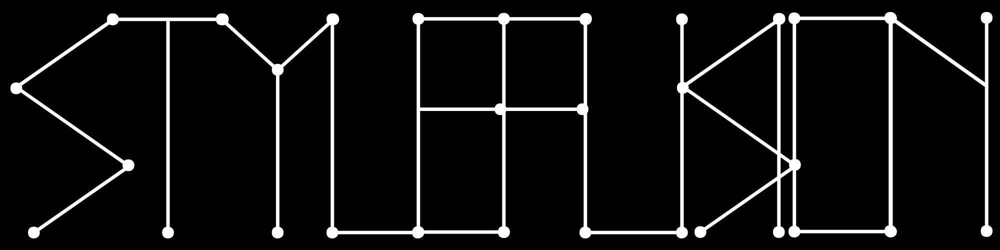

  

<h1 align="center">StyleFusion</h1>

  <strong>Structured reference analysis and prompt compilation for visual generation.</strong> 
  Extract. Blend. Compile. Record.

  <a href="https://hob.farm/workshop/stylefusion/">Project page</a> ·
  <a href="https://hob.farm">HobFarm</a>

---

## Current status

StyleFusion is an active private-development project. This public repository is a controlled project brief and documentation surface. It does not contain the current application source, private schemas, provider credentials, paid assets, internal test corpus, or production configuration.

The older public description presented StyleFusion as a launched subscription platform with fixed pricing and broad provider coverage. That no longer describes the current project.

## What StyleFusion does

StyleFusion turns one or more reference images into a traceable visual-generation record.

The current workflow is:

1. Add reference images.
2. Assign each reference a role and weight.
3. Analyze visual structure into a typed Intermediate Representation.
4. Blend compatible evidence while preserving source attribution.
5. Compile a master prompt and provider-specific variants.
6. Export reusable Markdown and JSON records.
7. Optionally send the compiled request to a selected image provider.

The system is built to compare extraction and generation behavior across providers without letting model-specific prompt conventions become the source of truth.

## Design goals

- **Schema-first output:** visual facts and generation instructions live in typed records rather than loose prompt text.
- **Evidence-aware blending:** extracted features remain connected to the references that supplied them.
- **Provider separation:** analysis, compilation, and generation are distinct stages with replaceable provider adapters.
- **Reproducible exports:** each run can record model, endpoint, profile, intent, dimensions, prompt hash, timing, warnings, filenames, and notes.
- **Human review:** generated output is inspected and corrected rather than silently promoted into reusable project knowledge.
- **Private-by-default project data:** user images, private style packs, credentials, internal corpora, and production records stay out of the public repository.

## Current output targets

StyleFusion currently focuses on still-image workflows:

- structured reference analysis
- weighted multi-reference blending
- master and provider-specific prompt compilation
- reusable StyleFusion Markdown exports
- machine-readable JSON exports
- portrait, fashion, scene, and character-sheet derivatives
- motion-safe image guidance for later image-to-video use

Video generation is a future integration layer, not a current product claim.

## Relationship to Grimoire

StyleFusion can consume reviewed vocabulary, schemas, and project knowledge from Grimoire. Enrichment is evidence-triggered and must remain traceable. Grimoire is not used as a random adjective injector, and private Grimoire data is not published through this repository.

## Repository boundary

This repository may contain:

- public project documentation
- selected architecture notes
- sanitized examples
- screenshots or diagrams approved for publication
- contribution guidance for documentation or public tooling

It must not contain:

- current proprietary application source
- API keys, tokens, account identifiers, or local environment files
- private Grimoire packs or source corpora
- unreleased client or project images
- paid downloads or full-resolution private assets
- raw production logs
- provider billing data

## Collaboration

Technical discussion and serious collaboration inquiries are welcome, especially around structured visual IRs, evidence-aware blending, provider adapters, generation provenance, and durable creative tooling.

Use the [HobFarm contact page](https://hob.farm/contact/) for direct inquiries.

## License

Copyright © 2025–2026 HobFarm. All rights reserved.

This repository contains documentation and promotional material only. No license is granted to copy, modify, distribute, or commercially reuse the StyleFusion application, schemas, documentation, visual identity, or related project materials unless a separate license explicitly says otherwise. See [LICENSE](LICENSE).
